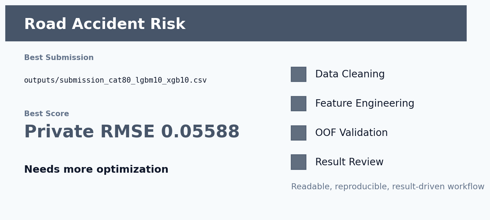

# Kaggle 道路事故风险预测



## 项目一句话

根据道路、天气、光照、速度和事故历史预测 accident_risk。

这个项目不是简单跑一个 baseline，而是围绕 **数据清洗 -> 特征工程 -> 稳定验证 -> 模型融合 -> 线上结果复盘** 做成一条完整建模链路。核心目标是：让模型不仅分数高，而且每一步为什么有效都能讲清楚。

## 当前结果

| 项目 | 内容 |
| --- | --- |
| Competition | `playground-series-s5e10` |
| Metric | `RMSE` |
| Best Submission | `outputs/submission_cat80_lgbm10_xgb10.csv` |
| Best Score | Private RMSE 0.05588 |
| Validation / Extra | Public RMSE 0.05563 / OOF 0.056087 |
| Status | 约前 46%，未达 top 20% |

## 数据清洗

- 检查道路类型、天气、光照等类别字段，并保持 CatBoost 原生类别处理。
- 对数值字段做异常范围和比例特征检查，避免除零。
- 外部原始数据曾被测试，但因分布偏移使 OOF 变差，最终不使用。

## 特征工程亮点

- speed_x_curvature、speed_per_lane、curvature_per_lane 描述车辆在道路上的物理风险。
- accidents_x_speed、accidents_x_curvature 把历史事故和当前道路条件结合。
- bad_weather、low_light、weather_light_risk 模拟能见度风险。
- 道路类型、天气、光照、时段、速度分箱等交叉特征增强场景识别。

这部分是项目最重要的地方：特征不是随便堆出来的，而是尽量贴近业务或数据生成逻辑。我的思路是先问“这个变量为什么会影响目标”，再把这个想法翻译成模型能理解的数值、类别、比例、交叉或序列表示。

## 模型方法

- CatBoost GPU 原生类别特征。
- LightGBM/XGBoost 使用 count encoding 和严格 OOF target encoding。
- 最终融合为 80% CatBoost + 10% LightGBM + 10% XGBoost。

验证上尽量使用 OOF 思路，避免只看一次线上提交。融合也不是机械平均，而是根据 OOF、public/private 表现和模型互补性来选择。

## 结果分析

- 当前最强是 CatBoost，说明类别场景组合对这个任务很关键。
- OOF 权重搜索虽略优，但线上没有涨分，说明存在验证/榜单分布差异。
- 项目离 top 20% 较远，后续需要重新研究数据生成公式，而不是继续盲目调参。

## 如何复现

安装依赖：

```bash
pip install -r requirements.txt
```

复现时先从 Kaggle 下载原始数据到 README 或脚本约定的数据目录。部分仓库为了保持轻量，只保留最佳提交文件、实验日志和核心说明；如果仓库中存在 `src/`、`notebooks/` 或 `kaggle_kernel_*`，优先从这些入口运行训练。

常见入口示例：

```bash
python src/train_best.py
# 或在 Kaggle 上运行 kaggle_kernel_* 中的 GPU kernel
```

如果当前项目只保留了最佳产物，则可直接查看 `outputs/` 中的 OOF、prediction、submission 和实验摘要文件。

## 未来改进方向

- 反推 synthetic target 生成逻辑，重点分析速度、曲率、天气和事故数的非线性关系。
- 做分段模型：不同 road_type/weather 下分别拟合残差。
- 做误差诊断图，找出模型最容易高估/低估的道路场景。

## 项目价值

这个项目可以体现三类能力：

- **建模能力**：能从 baseline 走到调参、融合和线上验证。
- **特征工程能力**：能把业务直觉、数据分布和模型输入连接起来。
- **复盘能力**：能说明为什么涨分、为什么不涨，以及下一步该往哪里优化。
